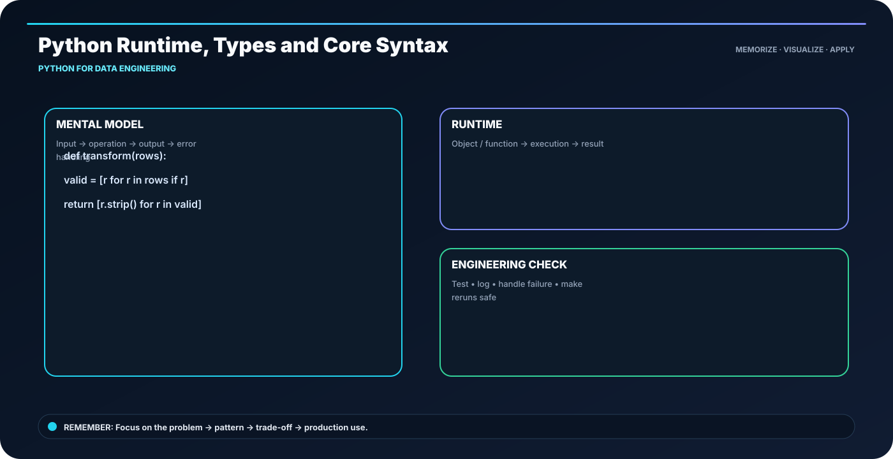

<div class="ia-section">

<div class="module-no">Module 04</div>

# Python for Data Engineering

**Learn → Visualize → Code → Practice → Explain**

</div>

---

## 🎯 The memory rule

> **type(x) → runtime type of x**

The goal of this module is not to memorize paragraphs. It is to build a mental model that you can **draw, implement and explain**.

---

## 🧭 Module roadmap

- **1. Python Runtime, Types and Core Syntax** — Python names reference objects; types belong to objects at runtime.
- **2. Collections, Operators and Control Flow** — Pick the collection by access pattern: list=order, set=membership, dict=key lookup.
- **3. Loops, Comprehensions and Generators** — Use comprehensions for compact finite transforms; generators for lazy streams.
- **4. Functions, Modules and Packages** — Small pure functions are easier to test, reuse and compose.
- **5. Object-Oriented Programming for Pipelines** — Use classes when state + behavior belong together; don't create classes just for syntax.
- **6. Files, CSV, JSON and ETL Transformations** — Stream large files instead of loading everything into RAM.
- **7. Exceptions, Logging, Decorators and CLI Tools** — Fail loudly with context; log enough to reproduce the failure.
- **8. NumPy and Pandas for Data Work** — NumPy is array-first; Pandas is table-first.

---

## 🖼️ Anchor concept visual



---

## 🧠 5-step recall loop

```text
DEFINE → DESIGN → BUILD → VALIDATE → OPERATE
```

For technical topics, add one more question:

> **What happens when this fails or runs 10× larger?**

---

## 💻 Module implementation pattern

```python
def transform(row):
    if not row["customer_id"]:
        raise ValueError("customer_id is required")
    row["amount"] = float(row["amount"])
    return row
```

---

## 🏭 Industry scenario

A production data team is building a platform where the same concepts must work across development, testing and production. The design is judged by **correctness, scale, security, cost and operability**, not only by whether the code runs once.

### Engineer checklist

- Clear input/output contract
- Correct data grain
- Safe retries and reruns
- Quality checks before publishing
- Useful logs and metrics
- Reproducible deployment
- Documented ownership and recovery path

---

## ⚠️ What usually goes wrong

- Tool-first design without clarifying the requirement
- Large reading blocks without a concrete example
- No evidence that the output is correct
- Hidden assumptions about scale or freshness
- Production code without failure handling

---

## 🧪 Module practice

1. Pick one topic and explain it using the visual.
2. Recreate the code pattern without copy-paste.
3. Change one requirement and explain what must change.
4. Add one quality check.
5. Describe one failure and recovery path.

---

## 📝 Assessment

Complete the module practice, lab and assignment. Your submission should contain:

- implementation / SQL / architecture,
- sample input and output,
- validation evidence,
- failure-handling decision,
- short README.

---

## 🚀 Industry-ready outcome

After this module, you should be able to:

**See the topic → recall the visual → write the pattern → explain the trade-off → debug the failure.**

**Infinity AI Cloud Academy — Industry Ready Data Engineering**
