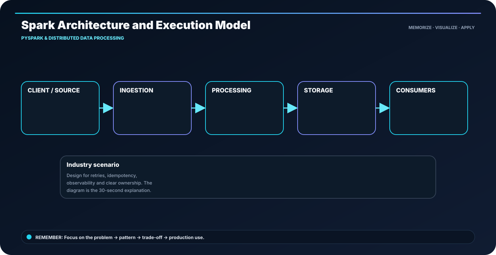

<div class="ia-section">

<div class="module-no">Module 07</div>

# PySpark & Distributed Data Processing

**Learn → Visualize → Code → Practice → Explain**

</div>

---

## 🎯 The memory rule

> **parallelism ≈ number of useful tasks, not just CPU count**

The goal of this module is not to memorize paragraphs. It is to build a mental model that you can **draw, implement and explain**.

---

## 🧭 Module roadmap

- **1. Spark Architecture and Execution Model** — Driver plans; executors run tasks; shuffle moves data.
- **2. RDDs and Functional Transformations** — RDDs expose distributed collections and transformations; DataFrames add optimized structured execution.
- **3. DataFrames and Spark SQL** — Prefer structured APIs so Spark can optimize the plan.
- **4. Transformations, Actions and Lazy Evaluation** — Transformations build a plan; actions execute it.
- **5. Joins, Aggregations and Window Functions** — Joins and aggregations often trigger shuffle; reduce data before them.
- **6. Partitions, Shuffle, Repartition and Coalesce** — repartition reshuffles; coalesce can reduce partitions with less movement.
- **7. Caching, Broadcast Joins and Performance** — Cache only reused data; broadcast only small dimensions.
- **8. Reading and Writing CSV, JSON and Parquet** — Parquet is columnar and typed; CSV is portable but expensive to parse.
- **9. PySpark ETL Project: Bronze to Silver to Gold** — Preserve raw, clean in Silver, publish business-ready Gold.

---

## 🖼️ Anchor concept visual



---

## 🧠 5-step recall loop

```text
DEFINE → DESIGN → BUILD → VALIDATE → OPERATE
```

For technical topics, add one more question:

> **What happens when this fails or runs 10× larger?**

---

## 💻 Module implementation pattern

```python
result = (
    df.filter("amount > 0")
      .groupBy("customer_id")
      .sum("amount")
)
```

---

## 🏭 Industry scenario

A production data team is building a platform where the same concepts must work across development, testing and production. The design is judged by **correctness, scale, security, cost and operability**, not only by whether the code runs once.

### Engineer checklist

- Clear input/output contract
- Correct data grain
- Safe retries and reruns
- Quality checks before publishing
- Useful logs and metrics
- Reproducible deployment
- Documented ownership and recovery path

---

## ⚠️ What usually goes wrong

- Tool-first design without clarifying the requirement
- Large reading blocks without a concrete example
- No evidence that the output is correct
- Hidden assumptions about scale or freshness
- Production code without failure handling

---

## 🧪 Module practice

1. Pick one topic and explain it using the visual.
2. Recreate the code pattern without copy-paste.
3. Change one requirement and explain what must change.
4. Add one quality check.
5. Describe one failure and recovery path.

---

## 📝 Assessment

Complete the module practice, lab and assignment. Your submission should contain:

- implementation / SQL / architecture,
- sample input and output,
- validation evidence,
- failure-handling decision,
- short README.

---

## 🚀 Industry-ready outcome

After this module, you should be able to:

**See the topic → recall the visual → write the pattern → explain the trade-off → debug the failure.**

**Infinity AI Cloud Academy — Industry Ready Data Engineering**
