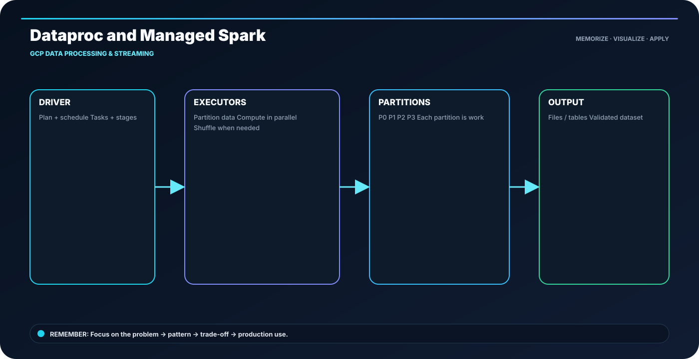

<div class="ia-section">

<div class="module-no">Module 10</div>

# GCP Data Processing & Streaming

**Learn → Visualize → Code → Practice → Explain**

</div>

---

## 🎯 The memory rule

> **cluster efficiency = useful compute / provisioned compute**

The goal of this module is not to memorize paragraphs. It is to build a mental model that you can **draw, implement and explain**.

---

## 🧭 Module roadmap

- **1. Dataproc and Managed Spark** — Dataproc is managed Spark/Hadoop infrastructure; your job still needs good partitioning and retries.
- **2. Dataflow and Apache Beam Programming Model** — Beam defines the pipeline model; Dataflow provides a managed execution engine.
- **3. Beam Element-wise and Aggregation Transforms** — Map/FlatMap/Filter change elements; Combine/GroupByKey aggregate.
- **4. Beam I/O, Composite Transforms and Side Inputs** — Keep I/O boundaries clear; package repeated logic as composite transforms.
- **5. Streaming Windowing, Triggers and Watermarks** — Window = when to group; trigger = when to emit; watermark = progress estimate.
- **6. Pub/Sub Event Ingestion** — Publishers emit; topics route; subscriptions deliver; consumers acknowledge.
- **7. Batch + Streaming Architecture on GCP** — Share contracts and serving layers where possible, but optimize each processing mode.
- **8. Production Dataflow Template Project** — Template the deployment, parameterize environment values, and monitor the run.

---

## 🖼️ Anchor concept visual



---

## 🧠 5-step recall loop

```text
DEFINE → DESIGN → BUILD → VALIDATE → OPERATE
```

For technical topics, add one more question:

> **What happens when this fails or runs 10× larger?**

---

## 💻 Module implementation pattern

```python
with beam.Pipeline() as p:
    (p | "Read" >> beam.io.ReadFromText("orders.csv")
       | "Parse" >> beam.Map(parse)
       | "Filter" >> beam.Filter(is_valid)
       | "Write" >> beam.io.WriteToText("curated"))
```

---

## 🏭 Industry scenario

A production data team is building a platform where the same concepts must work across development, testing and production. The design is judged by **correctness, scale, security, cost and operability**, not only by whether the code runs once.

### Engineer checklist

- Clear input/output contract
- Correct data grain
- Safe retries and reruns
- Quality checks before publishing
- Useful logs and metrics
- Reproducible deployment
- Documented ownership and recovery path

---

## ⚠️ What usually goes wrong

- Tool-first design without clarifying the requirement
- Large reading blocks without a concrete example
- No evidence that the output is correct
- Hidden assumptions about scale or freshness
- Production code without failure handling

---

## 🧪 Module practice

1. Pick one topic and explain it using the visual.
2. Recreate the code pattern without copy-paste.
3. Change one requirement and explain what must change.
4. Add one quality check.
5. Describe one failure and recovery path.

---

## 📝 Assessment

Complete the module practice, lab and assignment. Your submission should contain:

- implementation / SQL / architecture,
- sample input and output,
- validation evidence,
- failure-handling decision,
- short README.

---

## 🚀 Industry-ready outcome

After this module, you should be able to:

**See the topic → recall the visual → write the pattern → explain the trade-off → debug the failure.**

**Infinity AI Cloud Academy — Industry Ready Data Engineering**
