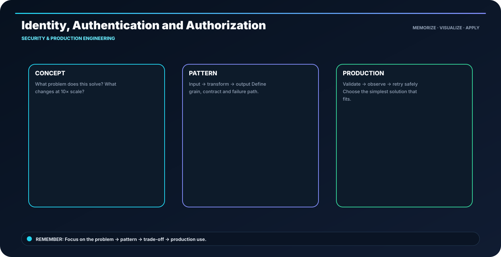

<div class="ia-section">

<div class="module-no">Module 14</div>

# Security & Production Engineering

**Learn → Visualize → Code → Practice → Explain**

</div>

---

## 🎯 The memory rule

> **access = identity + policy + resource**

The goal of this module is not to memorize paragraphs. It is to build a mental model that you can **draw, implement and explain**.

---

## 🧭 Module roadmap

- **1. Identity, Authentication and Authorization** — Authentication answers who; authorization answers what they may do.
- **2. Secrets Management and Credential Hygiene** — Never commit credentials; rotate and scope them.
- **3. Network and Data Security** — Protect data in transit, at rest and in use.
- **4. Encryption, KMS and Key Management** — Encryption is only useful when key access is controlled.
- **5. PII, Masking and Data Access Policies** — Classify sensitive data before deciding how it may be exposed.
- **6. Production Logging and Monitoring** — Logs explain; metrics quantify; traces connect.
- **7. Reliability, Backups, Disaster Recovery and Incident Management** — Recoverability is a design feature.

---

## 🖼️ Anchor concept visual



---

## 🧠 5-step recall loop

```text
DEFINE → DESIGN → BUILD → VALIDATE → OPERATE
```

For technical topics, add one more question:

> **What happens when this fails or runs 10× larger?**

---

## 💻 Module implementation pattern

```text
Identity → Least Privilege → Encryption → Audit → Incident Response
```

---

## 🏭 Industry scenario

A production data team is building a platform where the same concepts must work across development, testing and production. The design is judged by **correctness, scale, security, cost and operability**, not only by whether the code runs once.

### Engineer checklist

- Clear input/output contract
- Correct data grain
- Safe retries and reruns
- Quality checks before publishing
- Useful logs and metrics
- Reproducible deployment
- Documented ownership and recovery path

---

## ⚠️ What usually goes wrong

- Tool-first design without clarifying the requirement
- Large reading blocks without a concrete example
- No evidence that the output is correct
- Hidden assumptions about scale or freshness
- Production code without failure handling

---

## 🧪 Module practice

1. Pick one topic and explain it using the visual.
2. Recreate the code pattern without copy-paste.
3. Change one requirement and explain what must change.
4. Add one quality check.
5. Describe one failure and recovery path.

---

## 📝 Assessment

Complete the module practice, lab and assignment. Your submission should contain:

- implementation / SQL / architecture,
- sample input and output,
- validation evidence,
- failure-handling decision,
- short README.

---

## 🚀 Industry-ready outcome

After this module, you should be able to:

**See the topic → recall the visual → write the pattern → explain the trade-off → debug the failure.**

**Infinity AI Cloud Academy — Industry Ready Data Engineering**
