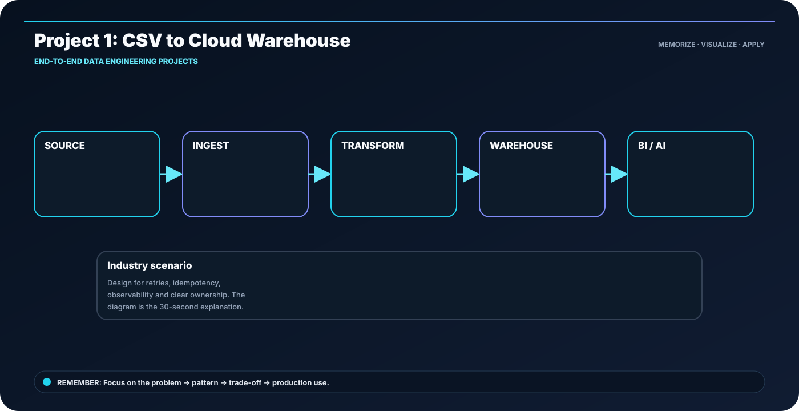

<div class="ia-section">

<div class="module-no">Module 17</div>

# End-to-End Data Engineering Projects

**Learn → Visualize → Code → Practice → Explain**

</div>

---

## 🎯 The memory rule

> **CSV → GCS → transform → BigQuery**

The goal of this module is not to memorize paragraphs. It is to build a mental model that you can **draw, implement and explain**.

---

## 🧭 Module roadmap

- **1. Project 1: CSV to Cloud Warehouse** — A simple batch pipeline is the best place to learn production discipline.
- **2. Project 2: API to Data Lake** — APIs fail differently from files: pagination, rate limits and schema drift matter.
- **3. Project 3: IoT Streaming Analytics** — IoT turns freshness, ordering and duplicates into first-class concerns.
- **4. Project 4: Data Quality + Observability** — A pipeline without evidence cannot prove trust.
- **5. Project 5: Spark + BigQuery Production Pipeline** — Distributed processing needs explicit schema, partitioning and operational controls.
- **6. Project 6: Complete Modern Data Platform Capstone** — Combine architecture, code, quality, security and operations into one system.

---

## 🖼️ Anchor concept visual



---

## 🧠 5-step recall loop

```text
DEFINE → DESIGN → BUILD → VALIDATE → OPERATE
```

For technical topics, add one more question:

> **What happens when this fails or runs 10× larger?**

---

## 💻 Module implementation pattern

```text
Source → Ingest → Process → Quality → Store → Serve → Monitor
```

---

## 🏭 Industry scenario

A production data team is building a platform where the same concepts must work across development, testing and production. The design is judged by **correctness, scale, security, cost and operability**, not only by whether the code runs once.

### Engineer checklist

- Clear input/output contract
- Correct data grain
- Safe retries and reruns
- Quality checks before publishing
- Useful logs and metrics
- Reproducible deployment
- Documented ownership and recovery path

---

## ⚠️ What usually goes wrong

- Tool-first design without clarifying the requirement
- Large reading blocks without a concrete example
- No evidence that the output is correct
- Hidden assumptions about scale or freshness
- Production code without failure handling

---

## 🧪 Module practice

1. Pick one topic and explain it using the visual.
2. Recreate the code pattern without copy-paste.
3. Change one requirement and explain what must change.
4. Add one quality check.
5. Describe one failure and recovery path.

---

## 📝 Assessment

Complete the module practice, lab and assignment. Your submission should contain:

- implementation / SQL / architecture,
- sample input and output,
- validation evidence,
- failure-handling decision,
- short README.

---

## 🚀 Industry-ready outcome

After this module, you should be able to:

**See the topic → recall the visual → write the pattern → explain the trade-off → debug the failure.**

**Infinity AI Cloud Academy — Industry Ready Data Engineering**
