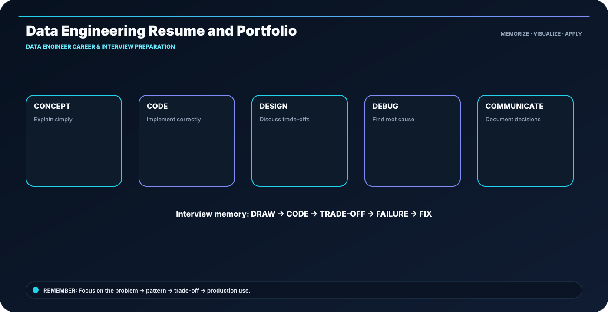

<div class="ia-section">

<div class="module-no">Module 19</div>

# Data Engineer Career & Interview Preparation

**Learn → Visualize → Code → Practice → Explain**

</div>

---

## 🎯 The memory rule

> **impact statement = action + scale + result**

The goal of this module is not to memorize paragraphs. It is to build a mental model that you can **draw, implement and explain**.

---

## 🧭 Module roadmap

- **1. Data Engineering Resume and Portfolio** — Show outcomes and engineering depth, not a tool inventory.
- **2. SQL Interview Patterns** — Recognize the pattern before writing the query.
- **3. Python and PySpark Interview Patterns** — Explain behavior, complexity and production implications.
- **4. Cloud and Architecture Interview Patterns** — Map services to responsibilities instead of memorizing product names.
- **5. Scenario-Based Pipeline Debugging** — Observe → isolate → reproduce → fix → prevent.
- **6. System Design Interview Practice** — Start with requirements and scale; then draw the simplest viable architecture.
- **7. Project Storytelling with STAR** — Situation, Task, Action, Result keeps technical stories outcome-focused.
- **8. Mock Interview and Job Readiness Plan** — Practice retrieval, not rereading.

---

## 🖼️ Anchor concept visual



---

## 🧠 5-step recall loop

```text
DEFINE → DESIGN → BUILD → VALIDATE → OPERATE
```

For technical topics, add one more question:

> **What happens when this fails or runs 10× larger?**

---

## 💻 Module implementation pattern

```text
Recall → Explain → Code → Debug → Design → Communicate
```

---

## 🏭 Industry scenario

A production data team is building a platform where the same concepts must work across development, testing and production. The design is judged by **correctness, scale, security, cost and operability**, not only by whether the code runs once.

### Engineer checklist

- Clear input/output contract
- Correct data grain
- Safe retries and reruns
- Quality checks before publishing
- Useful logs and metrics
- Reproducible deployment
- Documented ownership and recovery path

---

## ⚠️ What usually goes wrong

- Tool-first design without clarifying the requirement
- Large reading blocks without a concrete example
- No evidence that the output is correct
- Hidden assumptions about scale or freshness
- Production code without failure handling

---

## 🧪 Module practice

1. Pick one topic and explain it using the visual.
2. Recreate the code pattern without copy-paste.
3. Change one requirement and explain what must change.
4. Add one quality check.
5. Describe one failure and recovery path.

---

## 📝 Assessment

Complete the module practice, lab and assignment. Your submission should contain:

- implementation / SQL / architecture,
- sample input and output,
- validation evidence,
- failure-handling decision,
- short README.

---

## 🚀 Industry-ready outcome

After this module, you should be able to:

**See the topic → recall the visual → write the pattern → explain the trade-off → debug the failure.**

**Infinity AI Cloud Academy — Industry Ready Data Engineering**
