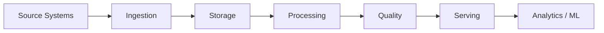

---

Module 17

# End-to-End Data Engineering Projects

**Learn • Build • Deploy • Innovate • Grow**

---

## Outcomes

- Understand end-to-end data engineering projects in a production data platform.
- Build a hands-on implementation or architecture.
- Validate quality, reliability and operational behavior.
- Prepare for project and interview discussions.

---

## Where this fits

---

## Module roadmap

- 1. Project 1: CSV to Cloud Warehouse
- 2. Project 2: API to Data Lake
- 3. Project 3: IoT Streaming Analytics
- 4. Project 4: Data Quality + Observability
- 5. Project 5: Spark + BigQuery Production Pipeline
- 6. Project 6: Complete Modern Data Platform Capstone

---

## Industry pattern

**Design for:** idempotency, schema evolution, observability, security, cost control and safe retries.

A production pipeline is not complete when the code runs once; it is complete when the team can operate it repeatedly and explain its behavior under failure.

---

## Hands-on workflow

1. Understand the requirement
2. Inspect source data
3. Design the pipeline
4. Implement
5. Validate
6. Observe
7. Document
8. Review

---

## Common mistakes

- Hard-coded credentials
- No schema or data contract
- Non-idempotent loads
- Missing validation
- Unbounded retries
- No alerting/runbook
- Optimizing before measuring

---

## Assessment

Complete the module lab, module assignment and practice set. Explain your design choices as if you were presenting the solution during a code review.

---

## Interview focus

Be ready to explain the **why**, not only the syntax: scale, reliability, data correctness, cost, security and maintainability.

---

## Next step

Use this module as a building block for the end-to-end capstone.

**Infinity AI Cloud Academy — Industry Ready Data Engineering**
