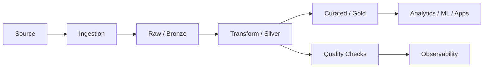

# Design Review: Production Data Platform

## Learning objectives

- Explain the core concepts behind design review: production data platform.
- Apply the concept to a realistic data engineering scenario.
- Identify common production failure modes and trade-offs.
- Communicate the implementation clearly in code or architecture documentation.

## Industry context

**Design Review: Production Data Platform** is taught here as an engineering capability rather than a syntax-only topic. The goal is to understand where the capability fits in a production data platform, what can fail, and how engineers make reliable trade-offs.

## Core concepts

1. **Problem definition** — identify the source, consumer, freshness requirement, volume, quality expectations and operational constraints.
2. **Design** — separate ingestion, transformation, storage, validation and serving responsibilities.
3. **Implementation** — use repeatable, version-controlled code and explicit configuration.
4. **Validation** — test correctness, schema, edge cases and failure handling before release.
5. **Operations** — expose logs, metrics, alerts and runbook information so the pipeline can be supported.

## Architecture lens

## Worked example

Suppose a retail company receives customer orders every hour. The engineering team needs to land raw records, standardize types, remove invalid rows, calculate business metrics and publish a curated dataset for analysts. The implementation should be **idempotent**, observable and safe to rerun.

### Engineering checklist

- Define the data contract and ownership.
- Choose the appropriate batch or streaming pattern.
- Make transformations deterministic and testable.
- Design for retries without duplicate business effects.
- Capture rejected records instead of silently dropping them.
- Document assumptions and operational runbooks.

## Hands-on

1. Create a small input dataset.
2. Implement the transformation or design requested in the lab.
3. Add at least three validation checks.
4. Produce an output that a downstream analyst or application could consume.
5. Document how the job behaves when input is missing, malformed or duplicated.

## Interview checkpoint

- What problem does this capability solve in a production data platform?
- What happens when the job is retried?
- How would you monitor correctness and freshness?
- What trade-off would you make if data volume increased 100x?

## Practice

1. Explain the concept in your own words.
2. Give one batch use case and one streaming use case.
3. Identify one failure mode and one mitigation.
4. Write or sketch the smallest production-safe implementation.
5. State two metrics you would monitor.

## Assignment

Build a small production-style example for **Design Review: Production Data Platform**. Submit source code or architecture, sample input/output, validation evidence, and a short README containing assumptions, failure handling and how to run the solution.
